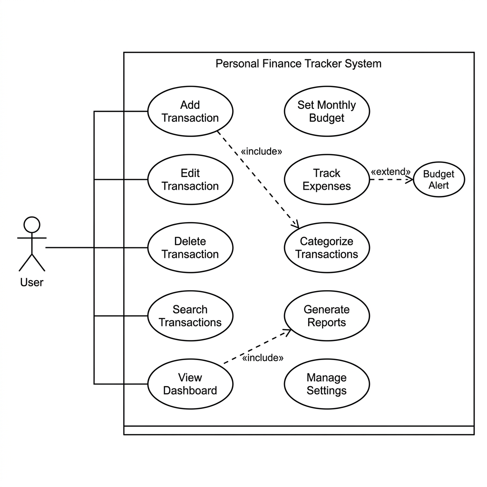
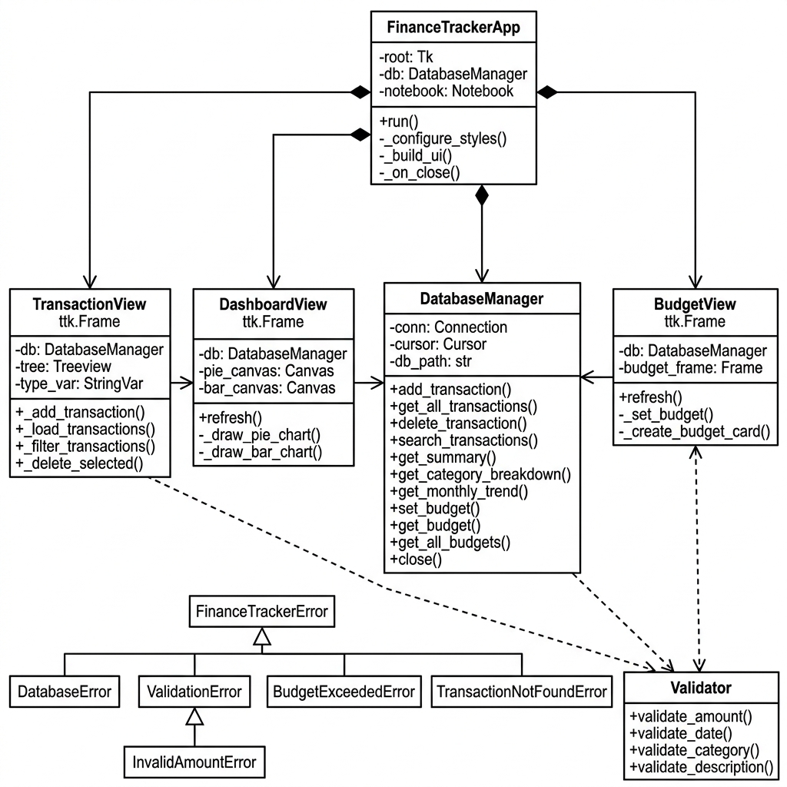
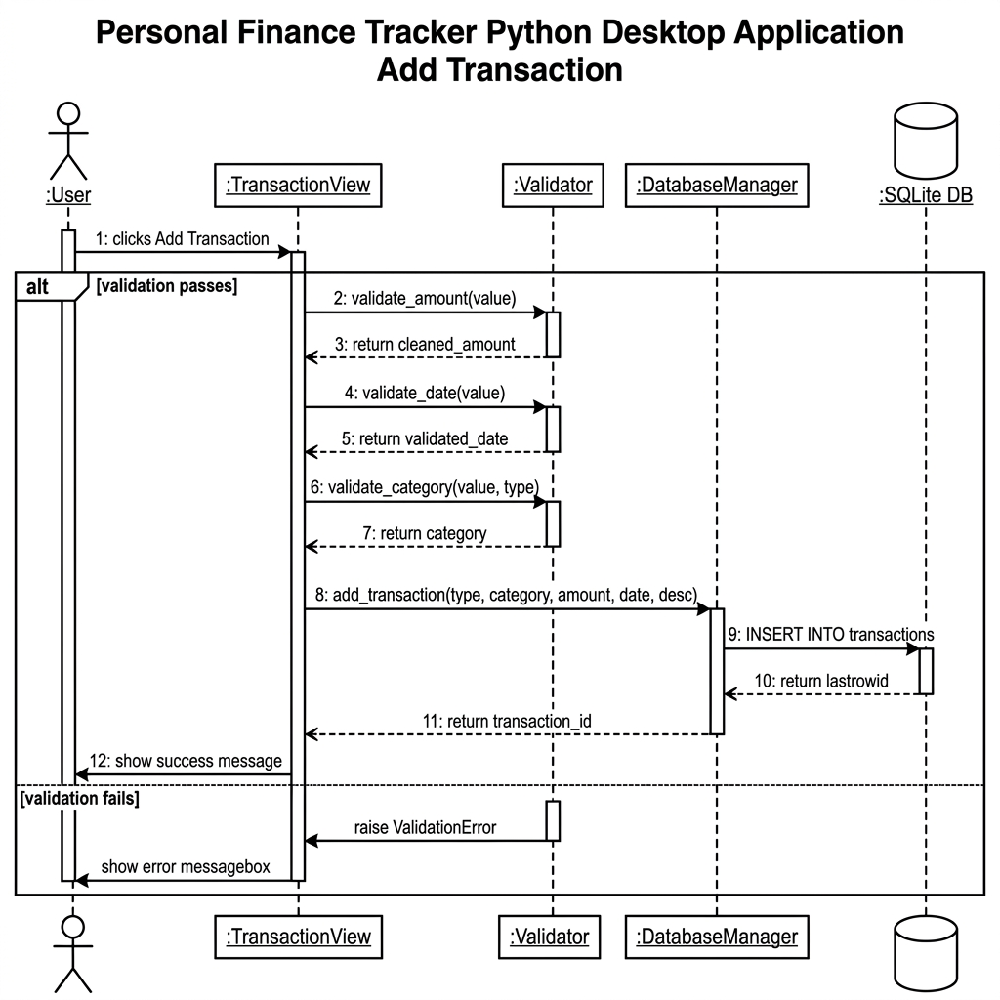
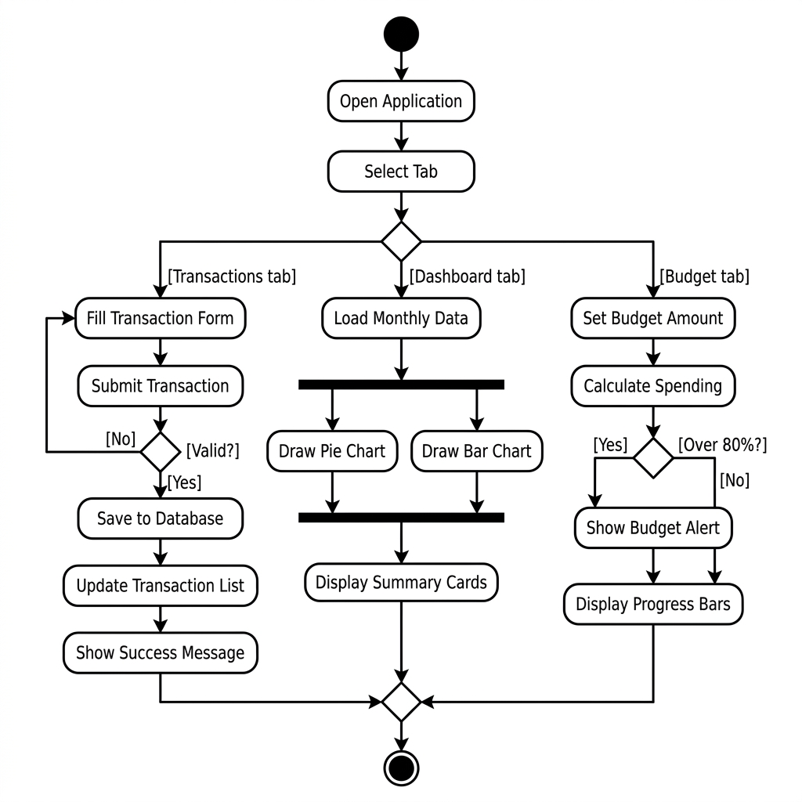
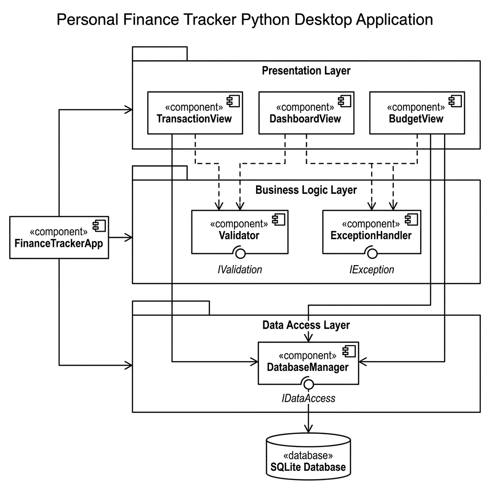
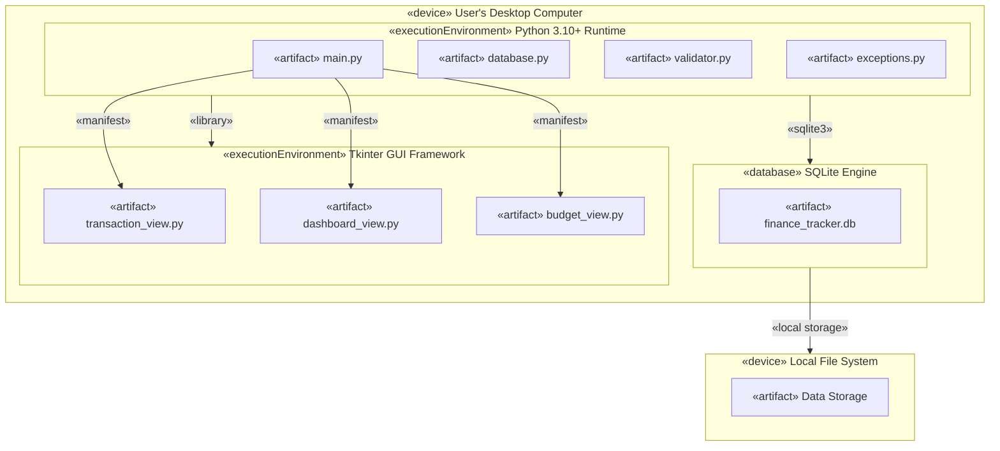

# UML Diagrams — Personal Finance Tracker

This document contains all 6 UML diagrams for the Personal Finance Tracker Desktop Application.

## Generated PNG Diagrams

| # | Diagram | File |
|---|---------|------|
| 1 | Use Case Diagram | `use_case_diagram.png` |
| 2 | Class Diagram | `class_diagram.png` |
| 3 | Sequence Diagram | `sequence_diagram.png` |
| 4 | Activity Diagram | `activity_diagram.png` |
| 5 | Component Diagram | `component_diagram.png` |
| 6 | Deployment Diagram | `deployment_diagram.md` (Mermaid source) |

---

## 1. Use Case Diagram

---

## 2. Class Diagram

---

## 3. Sequence Diagram

---

## 4. Activity Diagram

---

## 5. Component Diagram

---

## 6. Deployment Diagram

